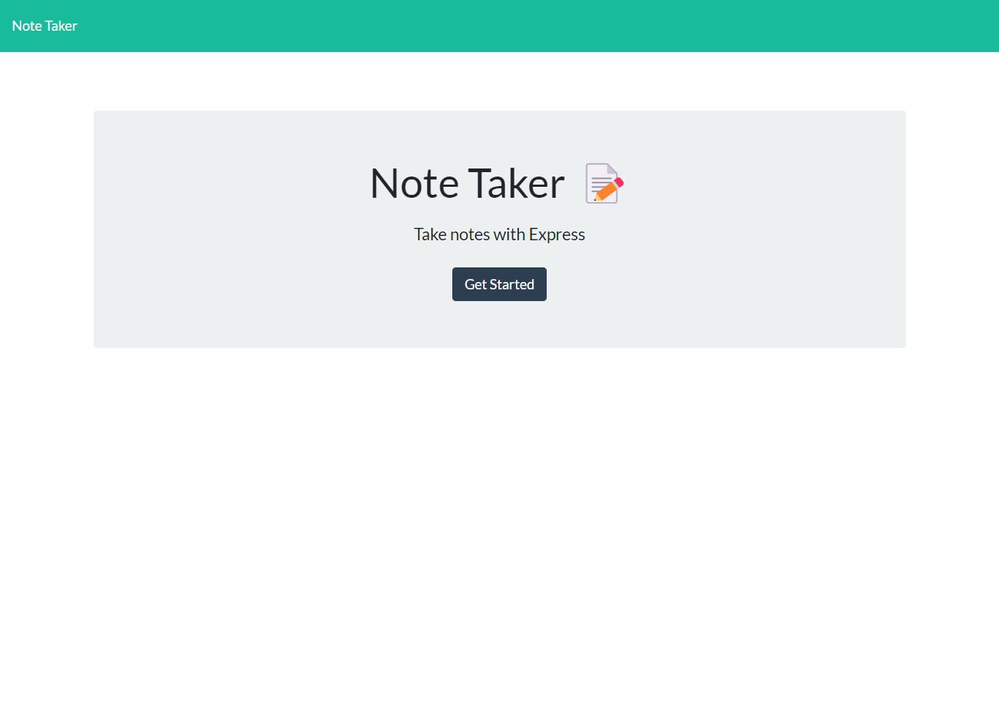
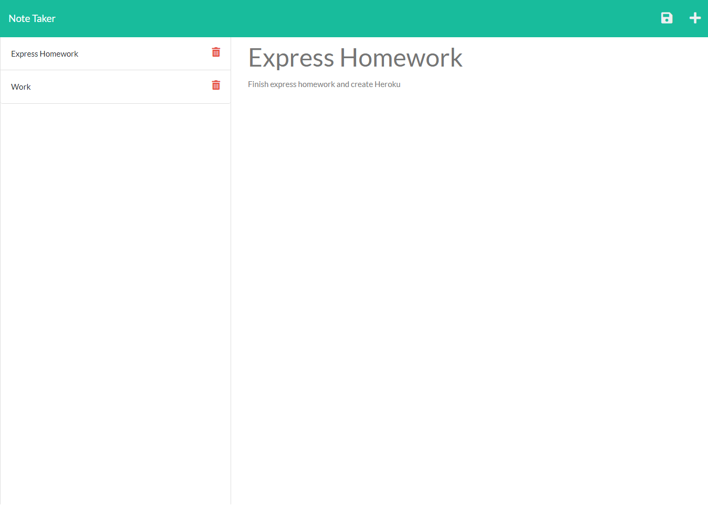

# express.js-notetaker

## Description
This express homework assignment is used as a note taker application. This application is also launched through Heroku. To begin with, package.json and package-lock.json are installed by typing "npm init" and "npm i", respectively. This allows us to use express, path, and other node applications. A "gitignore" file is also added that is used to tell Git which files to ignore. 

A server.js file is added that uses express to ultimately route the user into two different routing files (apiRoutes and htmlRoutes). If the user wants to start this application in their terminal through their local host, the user can simply type "npm start" into their terminal and it will provide them the link of the local host and port number for the user to use. 

In the "routes" folder, there are two different files named apiRoutes and htmlRoutes. "apiRoutes" uses a node installation that can be installed by typing "npm i uuid" into a user's terminal. These files allow a user to write/delete a note and adds the string into the db.json file in the "db" folder. 

Whether the user is launching the app through their local host or through Heroku, the user is able to click the "Get Started" button that takes them to a page where they could begin writing down notes. There is a "Note Title" and a "Note Text" for the user to fill. If the user would like to save this note, there is a save icon on the top right corner for them to click. If the user would like to add another note, there is a plus icon in the right corner. Lastly, if the user would like to delete a note, there is a trash icon next to the note on the left sidebar. 

## Website Screnshot

## Video Demonstration

[Video Link](vids&pics/express%20notetaker.webm)

## Heroku Link
[Heroku](https://calm-brushlands-14828.herokuapp.com/)